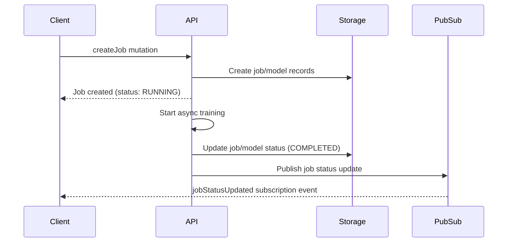
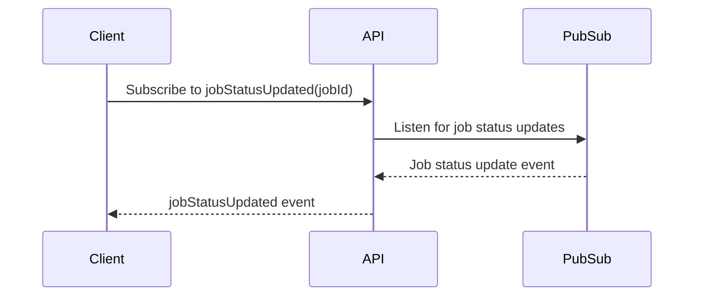
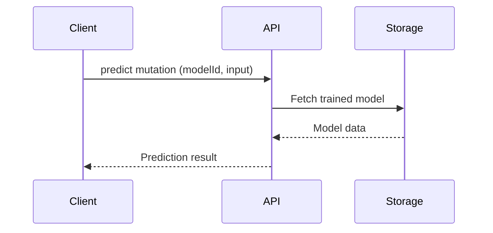

# Ask2.ai Backend Assignment

## Introduction

This project is a Node.js GraphQL API designed to simulate a machine learning workflow with two primary actions:

- **Training a Model:** This is a long-running, asynchronous operation. When a client requests model training, a job is created and processed in the background. The API supports job tracking and real-time status updates via GraphQL subscriptions, allowing clients to monitor the progress and completion of training jobs.

- **Prediction:** This is a short-running, synchronous task. Once a model is trained, clients can request predictions using the trained model. The prediction operation is executed immediately and returns the result without delay.

The API is built with Apollo Server, Express, Sequelize (with SQLite), and TypeScript, and demonstrates best practices for async job management, type safety, and real-time updates in a modern GraphQL backend.

## High-Level API Design

The backend is organized into three main components, each responsible for a key aspect of the system:

### 1. API Layer (GraphQL)

- Exposes a GraphQL schema for clients to create jobs, track job status, and request predictions.
- Handles incoming queries, mutations, and subscriptions.
- Delegates business logic to the storage and pubsub layers.

### 2. Storage Layer (Database)

- Uses Sequelize ORM with SQLite to persist jobs and models.
- Stores job metadata, model parameters, and training status.
- Provides transactional safety for job/model creation and updates.

### 3. PubSub Layer (Event/Subscription)

- Implements a publish/subscribe mechanism for real-time updates (using graphql-subscriptions).
- Publishes job status changes (e.g., when training completes or fails).
- Supports GraphQL subscriptions so clients can react to job progress and completion.

### Main Flows

- **Model Training (Async):**

  - Client sends a `createJob` mutation to start training a model.
  - API creates job and model records in the database (storage layer).
  - An async process simulates model training; on completion, updates the job/model status in storage and publishes a status update event (pubsub layer).

- **Job Status Subscription:**

  - Client subscribes to `jobStatusUpdated` for a specific job ID.
  - When the backend publishes a job status update (via pubsub), all subscribed clients receive real-time notifications through the API.

- **Prediction (Sync):**
  - Client sends a `predict` mutation with a model ID and input value.
  - API fetches the trained model from storage and returns the prediction result immediately (no pubsub involved).

---

#### Model Training (Async)



#### Job Status Subscription



#### Prediction (Sync)



> **Tip:** You can view and experiment with these diagrams at [mermaid.live](https://mermaid.live)

For more details, see the code in the respective `src/graphql`, `src/storage`, and `src/pubsub`

---

## Storage Modelling

Models and jobs are stored in separate tables in the database. Each job references a model via a `modelId` foreign key, allowing for clear separation and flexible querying.

### **Job Table Fields**

- `id`: Unique identifier for the job
- `status`: Current status of the job (e.g., RUNNING, COMPLETED, FAILED)
- `createdAt`: Timestamp when the job was created
- `updatedAt`: Timestamp when the job was last updated
- `modelId`: Foreign key referencing the associated model

### **Model Table Fields**

- `id`: Unique identifier for the model
- `type`: Type of regression (e.g., LINEAR, LASSO, RIDGE)
- `inputData`: Serialized input data used for training
- `status`: Current status of the model (e.g., TRAINING, TRAINED)
- `createdAt`: Timestamp when the model was created
- `updatedAt`: Timestamp when the model was last updated

---

## GraphQL Modelling

The GraphQL schema is designed to clearly separate asynchronous and synchronous flows, and to provide a type-safe, real-time API for clients.

### **Main Types**

- **Job:** Represents a training job. Fields include `id`, `status`, `createdAt`, `updatedAt`, `modelId`, and a `model` field (resolved via a field resolver).
- **Model:** Represents a trained or training model. Fields include `id`, `type`, `inputData`, `status`, `createdAt`, and `updatedAt`.
- **Prediction:** Represents the result of a prediction request. Fields include `value` (the predicted value), `modelId`, `input` (the input value), and `timestamp`.

### **Relationships and Design**

- Each **Job** references a **Model** via `modelId`. The `model` field on `Job` is resolved asynchronously using a field resolver, ensuring up-to-date model data.
- **Models** and **Jobs** are stored and queried separately, but are linked by `modelId`.
- The schema uses enums for job and model status, and for regression type, ensuring type safety and clarity.

### **Async vs Sync Flows**

- **Training (Async):** The `createJob` mutation starts a long-running job. Clients can track progress using the `jobStatusUpdated` subscription, which emits updates as the job status changes.
- **Prediction (Sync):** The `predict` mutation is synchronous and returns a prediction immediately for a trained model.

### **Field Resolvers**

- The `model` field on the `Job` type is always resolved via a field resolver, which fetches the model from the database using `modelId`. This keeps the schema DRY and ensures related data is always fresh.

### **Subscriptions**

- The `jobStatusUpdated` subscription allows clients to receive real-time updates about job status changes, filtered by `jobId`.

This modelling approach provides a robust, extensible, and type-safe API for managing and tracking ML jobs and predictions.

---

## Coding Practices & Design Choices

This project is intentionally kept simple and pragmatic, reflecting the needs of a small API backend. Key decisions include:

### **Main Packages and Why They Were Chosen**

- **Apollo Server:** Provides a robust, production-ready GraphQL server with great developer tooling and extensibility.
- **Express:** Lightweight, widely-used HTTP server framework that integrates easily with Apollo Server and middleware.
- **Sequelize (with SQLite):** Chosen for its simplicity and ease of use for relational data in small projects. SQLite requires no external setup, making local development and testing fast.
- **TypeScript:** Ensures type safety, better developer experience, and fewer runtime errors.
- **graphql-subscriptions:** Simple pub/sub implementation for real-time GraphQL subscriptions, suitable for demo and small-scale use.

### **Strong Typing**

- The codebase is strongly typed end-to-end using TypeScript and GraphQL code generation. All resolvers, models, and API layers use generated types, ensuring type safety and reducing runtime errors.

### **Trade-Offs**

- The stack is intentionally minimal—no microservices, no complex orchestration, and no heavy infrastructure. This keeps the codebase easy to understand and maintain for a small project.
- SQLite is used for convenience; in production, a more scalable database would be appropriate.
- The pub/sub layer is in-memory and not distributed, which is fine for a single-node demo but not for horizontal scaling.

### **Folder Structure**

- The codebase is organized by intention (feature/domain), not by technical type. For example, all job-related resolvers are grouped together, as are model-related files.
- This keeps the structure simple and easy to navigate, avoiding unnecessary complexity that can arise from over-engineering in small projects.

These choices make the project approachable, easy to extend, and well-suited for demonstration, prototyping, or as a learning resource.

---

## Development

### Running the Project

1. **Install dependencies:**
   ```bash
   npm install
   ```
2. **Build the project:**
   ```bash
   npm run build
   ```
3. **Start the server:**
   ```bash
   npm start
   ```
   The server will start and expose the GraphQL API at `http://localhost:4000/graphql` (or the port specified in your environment).

### Development Workflow

- For local development, you can use hot-reloading with:

  ```bash
  npm run dev
  ```

  This uses `nodemon` to automatically restart the server on code changes.

- **Environment Variables:**

  - You can configure the server using a `.env` file in the project root. Common variables include:
    - `PORT`: The port the server runs on (default: 4000)
    - `NODE_ENV`: Set to `development` or `production`
    - (Add other variables as needed for your setup)
  - The project uses `dotenv` to load these variables automatically.

- **Dev Mode Behavior:**

  - When `NODE_ENV=dev`, model training jobs complete much faster to speed up testing and iteration.
  - Debug logs are enabled, providing detailed output for easier troubleshooting and visibility into the system's behavior.

- **Code Generation:**

  - If you change the GraphQL schema, run:
    ```bash
    npm run generate-graphql-types
    ```
    This updates the generated TypeScript types for resolvers and schema safety.

- **Database:**
  - By default, the project uses a local SQLite database file. No setup is required for development.

---

## Demos

### Model Training

- [Watch a demo of model training and job tracking on Loom](https://www.loom.com/share/2d0121b44ada404f8411dbfb7f77e6dc?sid=aed39787-72be-4230-83d6-b9f48e776ade)

### Getting Predictions

- [Watch a demo of getting predictions on Loom](https://www.loom.com/share/ca53374ac63349a3be06864bb1315f97?sid=969a437b-d193-4aba-8dfe-d069a4fdee46)

---
